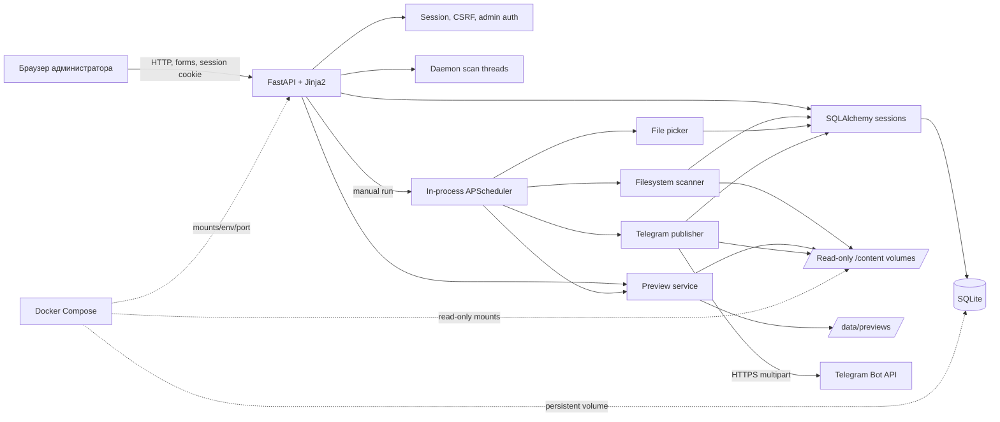
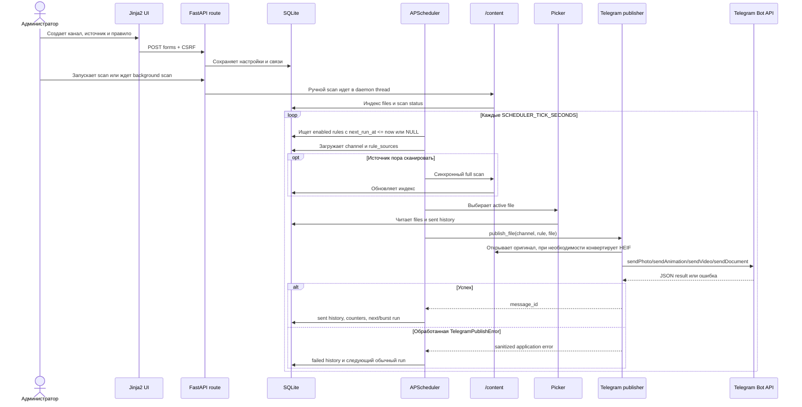

# Архитектура

## Обзор

Проект является модульным монолитом в одном Python-процессе. FastAPI обслуживает Jinja2 UI и небольшие JSON/file endpoints. На startup тот же процесс создает/обновляет таблицы и запускает APScheduler. Отдельного SPA, REST backend process, worker, queue, Redis или внешнего scheduler нет.

## Компоненты

### Web UI И HTTP

`app/main.py` создает приложение и middleware. `app/web.py` содержит 42 явно объявленных method/path combinations. Шаблоны из `app/templates/` рендерятся сервером; JavaScript в `base.html` добавляет CSRF token в POST-формы и управляет UI. Большинство ответов HTML/redirect, а не JSON.

Порядок lifecycle:

1. `init_db()` вызывает `create_all()` и ad hoc migrations.
2. Создается `AppScheduler`.
3. Регистрируются три interval jobs.
4. На shutdown scheduler останавливается с `wait=False`.

### Авторизация

`SessionMiddleware` подписывает cookie `tap_session`. Все HTTP paths, кроме `/login`, `/favicon.ico` и prefix `/static`, требуют `admin_authenticated`. Все application POST routes зависят от `csrf_protect`. Один admin хранится в SQLite; default `admin/admin` создается автоматически.

### База

SQLAlchemy использует `DATABASE_URL`, по умолчанию SQLite. Request handlers, scheduler и scan threads открывают отдельные sessions. Детали схемы: [database.md](database.md).

### Индексатор И Превью

Scanner обходит source path рекурсивно или на одном уровне, определяет тип по extension и синхронизирует `files`. Fingerprint состоит из relative path, size и mtime, а не content hash. Preview service читает оригинал и пишет PNG в `/data/previews`; для видео синхронно вызывает `ffprobe` и `ffmpeg`.

Выбор source path отделен от scanner: UI запрашивает до 200 непосредственных подпапок открытого каталога, а backend кеширует каждый уровень по path и directory mtime. Глубокая иерархия не обходится до запуска scan уже выбранного source.

### Планировщик

`AppScheduler` регистрирует:

| Job | Интервал | Работа |
| --- | --- | --- |
| `dispatch_due_rules` | `SCHEDULER_TICK_SECONDS` | Последовательно обрабатывает due enabled rules |
| `scan_due_sources` | `SCAN_TICK_SECONDS` | Полностью сканирует enabled non-manual sources |
| `backfill_previews` | `SCAN_TICK_SECONDS` | Генерирует до `PREVIEW_BATCH_SIZE` отсутствующих previews |

Jobs находятся в каждом application process. Несколько workers/replicas приведут к нескольким независимым schedulers.

### Docker И Инфраструктура

`Dockerfile` устанавливает Python dependencies, `tzdata`, `ffmpeg`, запускает один Uvicorn на `0.0.0.0:8080` и проверяет `/login`. Root Compose использует GHCR image, публикует `1338:8080` и монтирует `/data`, `/db` и host `./content`. Текущий content destination `/example` расходится с кодом, который обнаруживает только `/content`. Reverse proxy, TLS, firewall и backup automation в репозитории отсутствуют.

`.github/workflows/` содержит сборки multi-platform images для GHCR и Docker Hub.

## Жизненный Цикл Публикации

Важные нюансы:

- новое enabled rule имеет `next_run_at=NULL` и становится due на следующем tick;
- ручной `run rule now` использует тот же pipeline, пропускает allowed-hours check и изменяет burst/schedule state;
- до Telegram call файл не резервируется, поэтому конкурентные вызовы могут дублировать пост;
- исключения вне `TelegramPublishError` не записываются в history и не пересчитывают schedule;
- manual rule run ошибочно записывается как scheduled, потому что `manual_trigger` не передается.

При requeueable file error индексная запись файла деактивируется, а failed history сохраняется. К ним относятся missing file и отказ единственного `sendDocument` fallback после `PHOTO_INVALID_DIMENSIONS`. `POST /history/{history_id}/requeue` повторно проверяет source root относительно `/content`, file containment, recursion/type filters и текущую связь source с rule, обновляет metadata и реактивирует файл. History row получает отметку о возврате и повторно не обрабатывается. Endpoint не вызывает Telegram и не меняет schedule; после commit файл снова доступен обычному picker. Общий race с automatic scan остается в рамках KI-010.

Optional photo optimization выполняется только для rule с `optimize_large_photos=true`: metadata/pixel cap проверяются до decode, затем Pillow создает временный JPEG с безопасными dimensions/size, а оригинал остается на read-only content mount. Все temporary variants очищаются при encoder/publisher errors и после завершения внешнего запроса. CPU/decode работа пока выполняется синхронно и остается частью общего KI-008.

## Границы Доверия

- Браузер администратора имеет полный контроль над каналами, источниками и отправкой.
- SQLite содержит bot tokens и password hashes; файл БД является секретом.
- `/content` считается недоверенным пользовательским контентом. Сейчас originals отдаются inline с origin панели, что небезопасно.
- Telegram Bot API является внешней сетью; retries/idempotency не реализованы.
- Reverse proxy headers сейчас не имеют configured trust boundary.

## Неподтвержденное

- Production reverse proxy/TLS и network exposure.
- Доступность и актуальность опубликованных GHCR/Docker Hub tags.
- Реальный размер архивов, нагрузка и допустимые задержки.
- Намеренность поведения manual run с burst и disabled entities.
