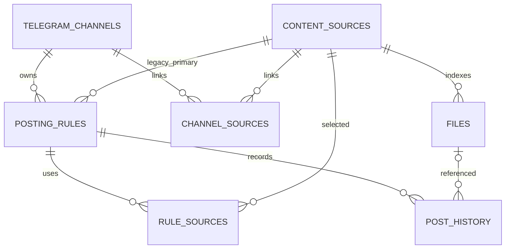

# База Данных

## Engine И Lifecycle

SQLAlchemy 2.0 создает engine при импорте `app.db`. Для SQLite используется `check_same_thread=False`; `PRAGMA foreign_keys=ON` не устанавливается. `SessionLocal` имеет `autoflush=False`, `expire_on_commit=False`.

На FastAPI startup:

1. `Base.metadata.create_all()` создает отсутствующие таблицы/индексы.
2. `migrate_schema()` проверяет имена таблиц/колонок.
3. Raw `ALTER TABLE` добавляет известные колонки.
4. Legacy Telegram config и source links backfill-ятся.
5. Создаются singleton file settings и default admin при отсутствии.

Alembic, schema version table, downgrade и migration lock отсутствуют. SQL содержит `INSERT OR IGNORE`, поэтому `DATABASE_URL` с другой СУБД фактически не поддерживается.

## Схема

## Таблицы

### `telegram_channels`

Каналы/назначения Telegram. `name` unique; `bot_token`, `chat_id` и integer `message_thread_id` nullable; `parse_mode`, default caption, notification/protection flags, enabled, timestamps. Token хранится plaintext.

### `telegram_config`

Legacy single-channel config. Runtime routes ее не используют; startup читает первую строку при создании первого `telegram_channels`. Автоматически не удаляется.

### `content_sources`

Source name/path (оба unique), enabled/recursive, CSV media kinds в `allowed_extensions`, scan interval/manual-only, last scan result/time и persisted progress/in-progress fields.

Relationships включают files, link tables и legacy `rules` ownership через `posting_rules.source_id`. Последнее имеет опасный `delete-orphan` cascade.

### `files`

Индекс metadata: source FK, relative/absolute paths, media kind, size, mtime, fingerprint, active state, discovered/seen/posted times и post count.

- unique: `(source_id, relative_path)`;
- index: `(source_id, is_active)`;
- fingerprint: SHA-1 от path, size и mtime, не от содержимого.

### `posting_rules`

Глобально unique name, enabled, channel FK и mandatory legacy primary `source_id`. Хранит interval/allowed hours/jitter, burst state, selection settings, caption/chat override, флаги добавления имени/relative path файла, document/HEIF/photo-optimization flags и runtime timestamps/result.

Актуальный multi-source набор задает `rule_sources`; `source_id` синхронизируется с минимальным selected ID для совместимости. `source_selection_mode` хранится, но фактически picker его не использует.

### `post_history`

Attempt log: rule/source/file FKs, `sent|failed|skipped`, `manual_trigger`, message, optional `processing_log`, Telegram message ID и attempted time. Processing log хранит безопасные этапы image optimization/fallback без token и absolute path.

- index: `(rule_id, status)`;
- file delete задекларирован как `SET NULL`, но SQLite FK enforcement не включен;
- rule ORM delete удаляет history через `delete-orphan`.

### `channel_sources`

Many-to-many канал/источник, unique `(channel_id, source_id)`.

### `rule_sources`

Many-to-many правило/источник, unique `(rule_id, source_id)`.

### `admin_accounts`

Один фактически используемый row ID 1: unique username, PBKDF2 salt/hash, timestamps. Default `admin/admin` создается startup/lazy path.

### `login_throttles`

Primary key client string, failure count, last failure и block-until. Очистка выполняется только при следующей проверке этого client key или успешном login.

### `file_browser_settings`

Singleton ID 1: list/grid mode, card size, page size, thumbnail size и timestamps.

## Startup Migrations

Перед первым запуском новой версии нужно остановить приложение и сделать файловую копию SQLite DB. Новые caption/photo-optimization flags добавляются idempotent `ALTER TABLE` со значением `0` для существующих правил; рабочая БД не используется для проверки migration path.

Подтвержденные upgrades:

- добавление channel/burst/HEIF/source-selection, filename-caption и photo-optimization fields в `posting_rules`;
- добавление nullable `message_thread_id` в `telegram_channels` для тем групп-форумов;
- добавление `manual_trigger` и nullable `processing_log` в `post_history`;
- добавление manual/progress fields в `content_sources`;
- перенос первой `telegram_config` в канал `Основной` при отсутствии каналов;
- заполнение nullable migrated `channel_id` первым каналом;
- backfill `channel_sources` и `rule_sources` из legacy rules;
- создание default settings/admin.

Ограничения:

- нет revision order и transactional plan для всех historical states;
- `create_all` не меняет существующие constraints/types;
- migrations не создают пропущенные FK constraints на added columns;
- concurrent startup нескольких processes не защищен lock;
- rollback/downgrade отсутствует;
- локальная существующая схема может быть старее моделей до первого startup.

## Delete Semantics

- Channel ORM relationship удаляет rules и channel-source links; rule delete удаляет history/link rows.
- Source ORM relationship удаляет files, links и rules, где source является legacy primary. Это может удалить multi-source rule и его history, хотя у rule есть другие sources.
- Задекларированные DB `ON DELETE` нельзя считать надежными в SQLite до включения foreign keys на каждом connection.

Не проверяйте delete behavior на пользовательской БД. Используйте временную SQLite и явные assertions.

## Backup И Restore

Compose DB: `./db/app.db`. Direct-run default DB: `./data/app.db`. Не перепутайте их.

Для consistent backup остановите writers либо используйте SQLite backup API. База содержит bot tokens и должна храниться/передаваться как секрет. После restore нужны доступные originals по путям, совместимым с `files.absolute_path` и source configuration.

## Неподтвержденное

- Полный перечень historical schema versions, которые должны поддерживаться.
- Работа с PostgreSQL/MySQL.
- Реальная политика retention истории и login throttles.
- Требование сохранять legacy `telegram_config` бессрочно.
